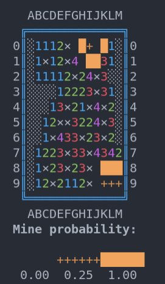

# ascii-minesweeper

A simple ASCII-graphics in-terminal implementation of the minesweeper with 'assist mode'.

Assist mode:
 * simple: press 'F' to fast-forward all obvious cells (e.g. when 2-cell has exactly 2 unopened cells around). 'Higher-order' logic is not implemented.
 * probabilistic: press 'E' to brute-force all possible mine locations with respect to constrains and calculate probabilities for each unopened cell to contain the mine. This procedure assumes all cells marked as mines to be correct. Works for sufficiently small amount of mines and unopened cells.





## Installation and usage

```bash
python -m venv venv
. venv/bin/activate
pip install -r requirements.txt
python play.py
```

To change field size and mine count edit the values in `play.py` manually.
